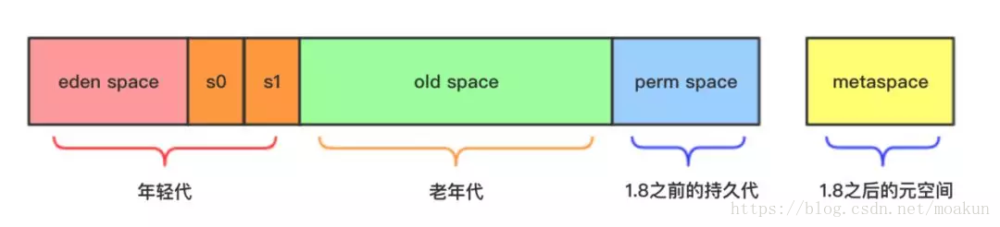
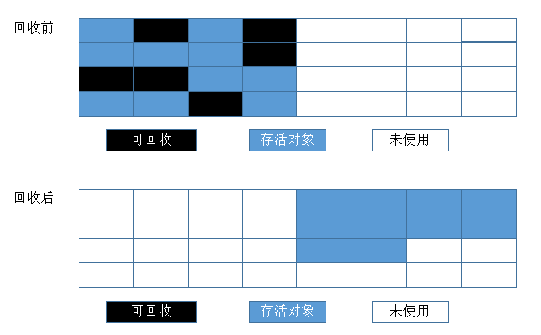

# Java 相关原理学习总结

[TOC]

## 一、JVM

> ### 1.Jvm体系结构
>
> >   
> > 主要由四方面组成：Java编程语言、Java类文件格式、Java虚拟机和Java应用程序接口(Java API)  
> > 
> > Java平台结构如下图：  
> >   
> > 在Java平台的结构中, 可以看出，Java虚拟机(JVM) 处在核心的位置，是程序与底层操作系统和硬件无关的关键。它的下方是移植接口，移植接口由两部分组成：适配器和Java操作系统, 其中依赖于平台的部分称为适配器；JVM 通过移植接口在具体的平台和操作系统上实现；在JVM 的上方是Java的基本类库和扩展类库以及它们的API， 利用Java API编写的应用程序(application) 和小程序(Java applet) 可以在任何Java平台上运行而无需考虑底层平台, 就是因为有Java虚拟机(JVM)实现了程序与操作系统的分离，从而实现了Java 的**平台无关性**。  
> > 
> > - **每个JVM都有两种机制：**
> > > **类装载子系统**：头戴具有适合名称的类或接口  
> > > **执行引擎**：负责执行假领在已装载的类或接口中的指令
> > - **每个JVM都包含：**
> > > 方法区、Java堆、Java栈、本地方法栈、指令计数器及其他隐含寄存器  
> > >   

> ### 2.Java编译
>
> > Java代码的编译和执行的整个过程大概是：开发人员编写Java代码(.java文件)，然后将之编译成字节码(.class文件)，再然后字节码被装入内存，一旦字节码进入虚拟机，它就会被解释器解释执行，或者是被即时代码发生器有选择的转换成机器码执行。  
> > Java代码编译是由Java源码编译器来完成，也就是Java代码到JVM字节码（.class文件）的过程。 流程图如下所示：  
> >   
> > 
> > **Java源码编译由以下三个过程组成:**
> > > - **分析和输入到符号表**
> > > - **注解处理**
> > > - **语义分析和生成class文件**
> > >
> > 流程图如下:  
> >   
> > 
> > **最后生成的class文件由以下部分组成：**
> > > - **结构信息**：包括class文件格式版本号及各部分的数量与大小的信息
> > > - **元数据**：对应于Java源码中声明与常量的信息。包含类/继承的超类/实现的接口的声明信息、域与方法声明信息和常量池
> > > - **方法信息**：对应Java源码中语句和表达式对应的信息。包含字节码、异常处理器表、求值栈与局部变量区大小、求值栈的类型记录、调试符号信息

> ### 3.ClassLoader  
>
> > #### (1)classLoader 有四种：
> >
> > > - **BootStrap ClassLoader**：启动类型加载器，负责加载核心类库`$JAVA_HOME$/lib`目录下的rt.jar、resources.jar、charsets.jar等Jar或class文件,由C++实现，不是ClassLoader子类  
> > > - **Extension Classloader**：扩展类加载器，负责加载Java平台中扩展功能的一些Jar包，包括`$JAVA_HOME$/lib/ext/*.jar`或`-Djava.ext.dirs`指定目录下的jar包
> > > - **App ClassLoader**：系统类加载器，负责加载classpath中指定的Jar包及目录中的class
> > > - **Custom ClassLoader**：自定义类型加载器，属于应用程序根据自身需要自定义的ClassLoader，如tomcat、jboss都会根据j2ee规范自行实现ClassLoader
>
> > #### (2)ClassLoader 加载过程：
> >
> > > 
> > > 检查顺序是自下而上：Custom => App => Extension => Bootstrap  
> > > 加载顺序是自上而下：Bootstrap => Extension => App => Custom  
>
> > #### (3)ClassLoader 加载原理
> >
> > > - **原理介绍：**  
> > > ClassLoader使用的是**双亲委托模型**来搜索类的，每个ClassLoader实例都有一个你类加载器的引用（不是继承的关系，是一个包含的关系），虚拟机内置的类加载器（Bootstrap ClassLoader）本身没有父类加载器，但可以用作其它ClassLoader实例的的父类加载器。当一个ClassLoader实例需要加载某个类时，它会试图亲自搜索某个类之前，先把这个任务委托给它的父类加载器，这个过程是由上至下依次检查的，首先由最顶层的类加载器Bootstrap ClassLoader试图加载，如果没加载到，则把任务转交给Extension ClassLoader试图加载，如果也没加载到，则转交给App ClassLoader 进行加载，如果它也没有加载得到的话，则返回给委托的发起者，由它到指定的文件系统或网络等URL中加载该类。如果它们都没有加载到这个类时，则抛出ClassNotFoundException异常。否则将这个找到的类生成一个类的定义，并将它加载到内存当中，最后返回这个类在内存中的Class实例对象。  
> > > - **为什么要使用双亲委托这种模型？**  
> > > 因为这样可以*避免重复加载*，当父亲已经加载了该类的时候，就没有必要子ClassLoader再加载一次。考虑到安全因素，我们试想一下，如果不使用这种委托模式，那我们就可以随时使用自定义的String来动态替代java核心api中定义的类型，这样会存在非常大的安全隐患，而双亲委托的方式，就可以避免这种情况，因为String已经在启动时就被引导类加载器（Bootstrcp ClassLoader）加载，所以用户自定义的ClassLoader永远也无法加载一个自己写的String，除非你改变JDK中ClassLoader搜索类的默认算法。
> > > - **如何判定两个class是相同的**  
> > > <u>JVM在判定两个class是否相同时，不仅要判断两个类名是否相同，而且要判断是否由同一个类加载器实例加载的。</u>只有两者同时满足的情况下，JVM才认为这两个class是相同的。就算两个class是同一份class字节码，如果被两个不同的ClassLoader实例所加载，JVM也会认为它们是两个不同class。比如网络上的一个Java类org.classloader.simple.NetClassLoaderSimple，javac编译之后生成字节码文件NetClassLoaderSimple.class，ClassLoaderA和ClassLoaderB这两个类加载器并读取了NetClassLoaderSimple.class文件，并分别定义出了java.lang.Class实例来表示这个类，对于JVM来说，它们是两个不同的实例对象，但它们确实是同一份字节码文件，如果试图将这个Class实例生成具体的对象进行转换时，就会抛运行时异常java.lang.ClassCaseException，提示这是两个不同的类型。  
>
> ### 4.JIT(即时编译)
>
> **TODO**
>
> ### 5.类执行机制
>
> > JVM是基于堆栈的虚拟机。JVM为每个新创建的线程都分配一个堆栈.也就是说,对于一个Java程序来说，它的运行就是通过对堆栈的操作来完成的。堆栈以帧为单位保存线程的状态。JVM对堆栈只进行两种操作:以帧为单位的压栈和出栈操作。  
> > JVM执行class字节码，线程创建后，都会产生程序计数器（PC）和栈（Stack），程序计数器存放下一条要执行的指令在方法内的偏移量，栈中存放一个个栈帧，每个栈帧对应着每个方法的每次调用，而栈帧又是有局部变量区和操作数栈两部分组成，局部变量区用于存放方法中的局部变量和参数，操作数栈中用于存放方法执行过程中产生的中间结果。栈的结构如下图所示：  
> > 

> ### 6.JVM内存
>
> JVM内存结构分为：**方法区（method）**，**栈内存（stack）**，**堆内存（heap）**，**本地方法栈（java中的jni调用）**，结构图如下所示：  
>   
>
> > #### (1)堆内存（Heap）
> >
> > > 所有通过new创建的对象的内存都在堆中分配，其大小可以通过-Xmx和-Xms来控制。   
> > > 操作系统有一个记录空闲内存地址的**链表**，当系统收到程序的申请时，会遍历该链表，寻找第一个空间大于所申请空间的堆结点，然后将该结点从空闲结点链表中删除，并将该结点的空间分配给程序，另外，对于大多数系统，会在这块内存空间中的首地址处记录本次分配的大小，这样代码中的delete语句才能正确的释放本内存空间。但由于找到的堆结点的大小不一定正好等于申请的大小，系统会自动的将多余的那部分重新放入空闲链表中。这时由new分配的内存，一般速度比较慢，而且容易产生内存碎片，不过用起来最方便。另外，在WINDOWS下，最好的方式是用VirtualAlloc分配内存，它不是在堆，也不是在栈，而是直接在进程的地址空间中保留一块内存，虽然这种方法用起来最不方便，但是速度快，也是最灵活的。堆内存是向高地址扩展的数据结构，是不连续的内存区域。由于系统是用链表来存储的空闲内存地址的，自然是不连续的，而链表的遍历方向是由低地址向高地址。堆的大小受限于计算机系统中有效的虚拟内存。由此可见，**堆获得的空间比较灵活，也比较大**。
>
> > #### (2)栈内存（stack）
> >
> > > 在Windows下, 栈是向低地址扩展的数据结构，是一块**连续的内存区域**。这句话的意思是栈顶的地址和栈的最大容量是系统预先规定好的，在WINDOWS下，栈的大小是固定的（是一个编译时就确定的常数），如果申请的空间超过栈的剩余空间时，将提示overflow。因此，**能从栈获得的空间较小**。只要栈的剩余空间大于所申请空间，系统将为程序提供内存，否则将报异常提示栈溢出。 由系统自动分配，速度较快。但程序员是无法控制的。  
> > 
> > **堆内存与栈内存需要说明：**
> > - **基础数据类型**直接在**栈内存**
> > - **方法的形式参数**，直接在**栈内存**分配，当方法调用完成后从栈内存回收
> > - **引用数据类型**，需要用new来创建，<u>在栈内存保存一个指向堆内存的地址，堆内容中保存对象内容和数据</u>  
> > - **方法的引用参数**，在栈空间分配一个地址空间，并指向堆空间的对象区，当方法调用完成后从栈空间回收  
> > - **方法调用**时传入的参数，先在栈空间分配，在方法调用完成后从栈空间收回
> > - **字符串常量、static**在DATA区域分配，**this**在堆空间分配。
> > - **数组**既在栈空间分配数组名称，又在堆空间分配数组实际的大小
> >
> >   
>
> > #### (3)本地方法栈（java中的jni调用）
> >
> > > 用于支持**native**方法的执行，存储了每个native方法调用的状态。对于本地方法接口，实现JVM并不要求一定要有它的支持，甚至可以完全没有。Sun公司实现Java本地接口(JNI)是出于可移植性的考虑，当然我们也可以设计出其它的本地接口来代替Sun公司的JNI。但是这些设计与实现是比较复杂的事情，需要确保垃圾回收器不会将那些正在被本地方法调用的对象释放掉。
>
> > #### (4)方法区
> >
> > > 它保存方法代码(编译后的java代码)和符号表。存放了要加载的**类信息**、**静态变量**、**final类型的常量**、**属性**和**方法信息**。JVM用持久代（Permanet Generation）来存放方法区，可通过-XX:PermSize和-XX:MaxPermSize来指定最小值和最大值。

> ### 7.垃圾回收（GC）  
>
> > #### (1) 什么是GC？
> >
> > GC是垃圾收集的意思，内存处理是编程人员容易出现问题的地方，忘记或者错误的内存回收会导致程序或系统的不稳定甚至崩溃，Java提供的GC功能可以自动监测对象是否超过作用域从而达到自动回收内存的目的，Java语言没有提供释放已分配内存的显示操作方法。Java程序员不用担心内存管理，因为垃圾收集器会自动进行管理。
> > 强制系统垃圾回收有两个方法：
> > - 调用System类的gc()静态方法：System.gc()
> > - 调用Runtime对象的gc()实例方法: Runtime.getRuntime().gc()
>
> > #### (2) 哪些内存需要回收?  
> >
> > > 如何到需要回收的内存的算法：
> > > - ~~引用计数法：这种算法不能解决对象之间相互引用的情况，所以这种方法不靠谱~~
> > > - 可达性分析法：这个算法的基本思想是通过一系列称为“GC Roots”的对象作为起始点，从这些节点向下搜索，搜索所走过的路径称为引用链，当一个对象到GC Roots没有任何引用链（即GC Roots到对象不可达）时，则证明此对象是不可用的。
> > >
> > > 在Java语言中，可以作为GCRoots的对象包括下面几中:
> > > - 虚拟机栈（栈帧中的局部变量区，也叫做局部变量表）中引用的对象。
> > > - 方法区中的类静态属性引用的对象。
> > > - 方法区中常量引用的对象。
> > > - 本地方法栈中JNI(Native方法)引用的对象。
> > >
> > > 下面给出一个GCRoots的例子，如下图，为GCRoots的引用链，obj8、obj9、obj10都没有到GCRoots对象的引用链，所以会进行回收。  
> > >   
>
> > #### (3) Java四种对象引用类型
> >
> > >   
> > > - **强引用（StrongReference）**：强引用是使用最普遍的引用。<u>如果一个对象具有强引用，那垃圾回收器绝不会回收它</u>。当内存空间不足，Java虚拟机宁愿抛出OutOfMemoryError错误，使程序异常终止，也不会靠随意回收具有强引用的对象来解决内存不足的问题。如：`Object o = new Object()`
> > > - **软引用（SoftReference）**：如果一个对象只具有软引用，则<u>内存空间足够，垃圾回收器就不会回收它</U>；<u>如果内存空间不足了，就会回收这些对象的内存</U>。只要垃圾回收器没有回收它，该对象就可以被程序使用。软引用可用来实现内存敏感的高速缓存。  
> > > 软引用可以和一个引用队列（ReferenceQueue）联合使用，如果软引用所引用的对象被垃圾回收器回收，Java虚拟机就会把这个软引用加入到与之关联的引用队列中。如：
> > > ```java
> > > // 使用"SoftReference"来实现软引用
> > > Object o = new Object();
> > > o.xxx();
> > > SoftReference sr = new SoftReference(o);
> > > ```
> > > - **弱引用（WeakReference）**：弱引用与软引用的区别在于：只具有弱引用的对象拥有更短暂的生命周期。<u>在垃圾回收器线程扫描它所管辖的内存区域的过程中，一旦发现了只具有弱引用的对象，不管当前内存空间足够与否，都会回收它的内存</u>。不过，由于垃圾回收器是一个优先级很低的线程，因此不一定会很快发现那些只具有弱引用的对象。
> > > ```java
> > > // 使用"WeakReference"来实现弱引用
> > > WeakReference<TestObject> weakReference=new WeakReference<>(new TestObject());
> > > System.out.println(weakReference.get() == null);//false
> > > System.gc();
> > > TimeUnit.SECONDS.sleep(1);//暂停一秒钟
> > > System.out.println(weakReference.get() == null);//true
> > > ```
> > > - **虚引用（PhantomReference）**：“虚引用”顾名思义，就是形同虚设，与其他几种引用都不同，虚引用并不会决定对象的生命周期。如果一个对象仅持有虚引用，那么它就和没有任何引用一样，在任何时候都可能被垃圾回收器回收。  
> > > 虚引用主要用来跟踪对象被垃圾回收器回收的活动。虚引用与软引用和弱引用的一个区别在于：虚引用必须和引用队列 （ReferenceQueue）联合使用。当垃圾回收器准备回收一个对象时，如果发现它还有虚引用，就会在回收对象的内存之前，把这个虚引用加入到与之 关联的引用队列中。弱引用可以和一个引用队列（ReferenceQueue）联合使用，如果弱引用所引用的对象被垃圾回收，Java虚拟机就会把这个弱引用加入到与之关联的引用队列中。
> > > ```java
> > > // 使用"PhantomReference"类实现需引用,虚引用必须与"ReferenceQueue"结合使用
> > > ReferenceQueue rq = new ReferenceQueue();
> > > TestWeakReference twr = new TestWeakReference();
> > > PhantomReference pr = new PhantomReference(twr, rq);
> > > System.out.println("before gc: " + pr.get() + ", " + rq.poll());
> > > twr = null;  //去掉强引用twr
> > > System.gc();
> > > System.out.println("after  gc: " + pr.get() + "," + rq.poll());
> > > ```
> > >  
> > > **引用队列（RefereneQueue）** 可以与软引用、弱引用以及虚引用一起配合使用，当垃圾回收器准备回收一个对象时，如果发现它还有引用，那么就会在回收对象之前，把这个引用加入到与之关联的引用队列中去。程序可以通过判断引用队列中是否已经加入了引用，来判断被引用的对象是否将要被垃圾回收，这样就可以在对象被回收之前采取一些必要的措施。  
> > > 与软引用、弱引用不同，虚引用必须和引用队列一起使用。
>
> > #### (4) 方法区的垃圾回收
> >
> > > 方法区的垃圾回收主要回收两部分内容：
> > > > - 废弃常量
> > > > - 无用的类
> > >
> > > 判断废弃常量:
> > > > - 以字面量回收为例，如果一个字符串“abc”已经进入常量池，但是当前系统没有任何一个String对象引用了叫做“abc”的字面量，那么，如果发生垃圾回收并且有必要时，“abc”就会被系统移出常量池。常量池中的其他类（接口）、方法、字段的符号引用也与此类似。
> > > 
> > > 判断无用的类:
> > > > - 该类的所有实例都已经被回收，即Java堆中不存在该类的任何实例。
> > > > - 加载该类的ClassLoader已经被回收。
> > > > - 该类对应的java.lang.Class对象没有在任何地方被引用，无法在任何地方通过反射访问该类的方法。
>
> > #### (5) 新生代、老年代、永久代 与 G1
> >
> > > Java堆从 GC的角度还可以细分为:新生代(Eden区、From Survivor区和 To Survivor区)和老年代。  
> > >    
> > >   
> >
> > > #### 1) 新生代
> > >
> > > > 是用来存放新生的对象。一般占据堆的1/3 空间。由于频繁创建对象，所以新生代会频繁触发MinorGC 进行垃圾 回收。新生代又分为Eden 区、ServivorFrom、 ServivorTo 3个区。  
> > > > - **Minor GC和Major GC(Full GC)区别**  
> > > > Minor GC：简单理解就是发生在年轻代的GC。三步（复制——清空——互换）  
> > > > - **Minor GC触发条件**  
> > > > 　　当产生一个新对象，新对象优先在**Eden区**分配。如果Eden区放不下这个对象，虚拟机会使用复制算法发生一次**Minor GC**，清除掉无用对象，同时将存活对象移动到**Survivor**的其中一个区(**fromspace区**或者**tospace区**)。  
> > > > 　　<u>虚拟机会给每个对象定义一个对象年龄(Age)计数器，对象在Survivor区中每“熬过”一次GC，年龄就会+1。待到年龄到达一定岁数(默认是15岁)，虚拟机就会将对象移动到年老代。</u>  
> > > > 　　如果新生对象在Eden区无法分配空间时，此时发生Minor GC。发生MinorGC，对象会从Eden区进入Survivor区，如果Survivor区放不下从Eden区过来的对象时，此时会使用**分配担保机制**将对象直接移动到年老代。  
> > > > Minor GC过程：  
> > > > 　　1.第一次**Yong GC(Minor GC)** 后，Eden区还存活的对象复制到Surviver区的“To”区，“From”区还存活的对象也复制到“To”区  
> > > > 　　2.再清空Eden区和From区，这样就等于“From”区完全是空的了，而“To”区也不会有内存碎片产生  
> > > > 　　3.等到第二次Yong GC时，“From”区和“To”区角色互换，很好的解决了内存碎片的问题。  
> > > > - **Major GC的触发条件**  
> > > > 　　<u>**Major GC又称为Full GC**。当年老代空间不够用的时候，虚拟机会使用“标记—清除”或者“标记—整理”算法清理出连续的内存空间，分配对象使用。</u>
> >
> > > #### 2) 老年代
> > >
> > > > 主要存放应用程序中生命周期长的内存对象。  
> > > > 老年代的对象比较稳定，所以MajorGC不会频繁执行。在进行MajorGC 前一般都先进行了一次MinorGC，使得有新生代的对象晋身入老年代，导致空间不够用时才触发。  
> > > > 当无法找到足够大的连续空间分配给新创建的较大对象时也会提前触发一次MajorGC进行垃圾回收腾出空间。   
> > > > MajorGC采用标记清除算法:首先扫描一次所有老年代，标记出存活的对象，然后回收没有标记的对象。MajorGC的耗时比较长，因为要扫描再回收。MajorGC 会产生内存碎片，为了减少内存损耗，我们一般需要进行合并或者标记出来方便下次直接分配。当老年代也满了装不下的时候，就会抛出**OOM (Out of Memory)异常**。  
> > > > 对象晋升：
> > > > >
> > > > > - 年龄阈值  
> > > > > VM为每个对象定义了一个**对象年龄(Age)** 计数器, 对象在Eden出生如果经第一次Minor GC后仍然存活, 且能被Survivor容纳的话, 将被移动到Survivor空间中, 并将年龄设为1。 以后对象在Survivor区中**每熬过一次Minor GC年龄就+1** ， 当增加到一定程度(`-XX:MaxTenuringThreshold`, **默认15**), 将会晋升到老年代。  
> > > > > - 提前晋升: 动态年龄判定  
> > > > > 然而VM并不总是要求对象的年龄必须达到MaxTenuringThreshold才能晋升老年代: <u>如果在Survivor空间中相同年龄所有对象大小的总和大于Survivor空间的一半, 年龄大于或等于该年龄的对象就可以直接进入老年代</u>, 而无须等到晋升年龄。  
> > > > >
> >
> > > #### 3) 永久代
> > >
> > > > 指内存的永久保存区域，<u>主要存放**Class** 和**Meta (元数据)** 的信息,Class在被加载的时候被放入永久区域，它和和存放实例的区域不同,GC不会在主程序运行期对永久区域进行清理。所以这也导致了永久代的区域会随着加载的Class 的增多而胀满，最终抛出**OOM异常**</u>。  
> > > > JAVA8与元数据 ：  
> > > > 　　<u>在Java8 中，永久代已经被移除，被一个称为 **“元数据区”(元空间)** 的区域所取代</u>。  
> > > > 　　元空间的本质和永久代类似，元空间与永久代之间最大的区别在于：<u>元空间并不在虚拟机中，而是使用本地内存。因此，默认情况下，元空间的大小仅受本地内存限制。</u>  
> > > > 　　<u>类的元数据放入**native memory** ,**字符串池**和**类的静态变量**放入**java 堆**中，这样可以加载多少类的元数据就不再由**MaxPermSize**控制，而由系统的实际可用空间来控制。</u>  
> >
> > > #### 4) G1
> > >
> > > > G1堆内存结构划分（它<u>将整个Java堆划分为多个大小相等的独立区域Region</u>）  
> > > >   
> > > > G1中提供了三种垃圾回收模式：
> > > > > - **Young GC**  
> > > > > 发生在年轻代的GC算法，一般对象（除了巨型对象）都是在eden region中分配内存，当所有eden region被耗尽无法申请内存时，就会触发一次young gc，这种触发机制和之前的young gc差不多，执行完一次young gc，活跃对象会被拷贝到survivor region或者晋升到old region中，空闲的region会被放入空闲列表中，等待下次被使用  
> > > > > - **Mixed GC**  
> > > > > 当越来越多的对象晋升到老年代old region时，为了避免堆内存被耗尽，虚拟机会触发一个**混合的垃圾收集器**，即mixed gc，该算法并不是一个old gc，除了回收整个young region，还会回收一部分的old region，这里需要注意：是一部分老年代，而不是全部老年代，可以选择哪些old region进行收集，从而可以对垃圾回收的耗时时间进行控制。  
> > > > > - **Full GC**  
> > > > > 如果对象内存分配速度过快，mixed gc来不及回收，导致老年代被填满，就会触发一次full gc，<u>G1的full gc算法就是单线程执行的serial old gc，会导致异常长时间的暂停时间，需要进行不断的调优，尽可能的避免full gc</u>  
>
> > #### (6) 垃圾收集算法
> >
> > > #### 1) 标记-清除（Mark-Sweep）算法
> > >
> > > > 是最基础的算法，标记-清除算法就如同它的名字样，分为“标记”和“清除”两个阶段：<u>首先标记出所有需要回收的对象，标记完成后统一回收所有被标记的对象</u>。这种算法的不足主要体现在效率和空间，从效率的角度讲，标记和清除两个过程的效率都不高；从空间的角度讲，标记清除后会产生大量不连续的内存碎片， 内存碎片太多可能会导致以后程序运行过程中在需要分配较大对象时，无法找到足够的连续内存而不得不提前触发一次垃圾收集动作。标记-清除算法执行过程如图：  
> > > >   
> >
> > > #### 2) 复制（Copying）算法
> > >
> > > > 复制算法是为了解决效率问题而出现的，它将可用的内存分为两块，<u>每次只用其中一块，当这一块内存用完了，就将还存活着的对象复制到另外一块上面，然后再把已经使用过的内存空间一次性清理掉</U>。这样每次只需要对整个半区进行内存回收，内存分配时也不需要考虑内存碎片等复杂情况，只需要移动指针，按照顺序分配即可。复制算法的执行过程如图：  
> > > >    
> > > > 不过这种算法有个缺点，<u>内存缩小为了原来的一半</u>，这样代价太高了。现在的商用虚拟机都采用这种算法来回收新生代，不过研究表明1:1的比例非常不科学，因此新生代的内存被划分为一块较大的Eden空间和两块较小的Survivor空间，每次使用Eden和其中一块Survivor。每次回收时，将Eden和Survivor中还存活着的对象一次性复制到另外一块Survivor空间上，最后清理掉Eden和刚才用过的Survivor空间。HotSpot虚拟机默认Eden区和Survivor区的比例为8:1，意思是每次新生代中可用内存空间为整个新生代容量的90%。当然，我们没有办法保证每次回收都只有不多于10%的对象存活，当Survivor空间不够用时，需要依赖老年代进行分配担保（Handle Promotion）。
> >
> > > #### 3) 标记-整理（Mark-Compact）算法
> > >
> > > > 复制算法在对象存活率较高的场景下要进行大量的复制操作，效率很低。万一对象100%存活，那么需要有额外的空间进行分配担保。老年代都是不易被回收的对象，对象存活率高，因此一般不能直接选用复制算法。根据老年代的特点，有人提出了另外一种标记-整理算法，<u>过程与标记-清除算法一样，不过不是直接对可回收对象进行清理，而是让所有存活对象都向一端移动，然后直接清理掉边界以外的内存</u>。标记-整理算法的工作过程如图：
> > > >   
>
> > #### (7) 垃圾收集器
> >
> > 垃圾收集器是收集算法的具体实现。不同虚拟机所提供的垃圾收集器可能会有很大差别，我们使用的是HotSpot，HotSpot这个虚拟机所包含的所有收集器如图：  
> >   
> > 上图展示了7种作用于不同分代的收集器，如果*两个收集器之间存在连线，那说明它们可以搭配使用*。虚拟机所处的区域说明它是属于新生代收集器还是老年代收集器。多说一句，我们必须明确一个观点：没有最好的垃圾收集器，更加没有万能的收集器，只能选择对具体应用最合适的收集器。这也是HotSpot为什么要实现这么多收集器的原因。
> >
> > > #### 1) Serial 收集器
> > >
> > > > 属于**新生代收集器**，最基本、发展历史最久的收集器，这个<u>收集器是一个采用**复制算法**的**单线程的收集器**</u>，单线程一方面意味着它只会使用一个CPU或一条线程去完成垃圾收集工作，另一方面也意味着<u>它进行垃圾收集时必须**暂停其他线程的所有工作**，直到它收集结束为止</u>。后者意味着，在用户不可见的情况下要把用户正常工作的线程全部停掉，这对很多应用是难以接受的。不过实际上到目前为止，<u>Serial收集器依然是虚拟机运行在**Client模式下的默认新生代收集器**</u>，因为它简单而高效。用户桌面应用场景中，分配给虚拟机管理的内存一般来说不会很大，收集几十兆甚至一两百兆的新生代停顿时间在几十毫秒最多一百毫秒，只要不是频繁发生，这点停顿是完全可以接受的。Serial收集器运行过程如下图所示：  
> > > >   
> > > > 说明：1. 需要STW（Stop The World），停顿时间长。2. 简单高效，对于单个CPU环境而言，Serial收集器由于没有线程交互开销，可以获取最高的单线程收集效率。  
> >
> > > #### 2) ParNew 收集器
> > >
> > > > <u>ParNew收集器其实就是Serial收集器的多线程版本，除了使用多条线程进行垃圾收集外，其余行为和Serial收集器完全一样，包括使用的也是复制算法</u>。ParNew收集器除了多线程以外和Serial收集器并没有太多创新的地方，但是<u>它却是**Server模式**下的虚拟机首选的**新生代收集器**</u>，其中有一个很重要的和性能无关的原因是，除了Serial收集器外，目前只有它能与CMS收集器配合工作（看图）。CMS收集器是一款几乎可以认为有划时代意义的垃圾收集器，因为它第一次实现了让垃圾收集线程与用户线程基本上同时工作。ParNew收集器在单CPU的环境中绝对不会有比Serial收集器更好的效果，甚至由于线程交互的开销，该收集器在两个CPU的环境中都不能百分之百保证可以超越Serial收集器。当然，随着可用CPU数量的增加，它对于GC时系统资源的有效利用还是很有好处的。<u>它默认开启的收集线程数与CPU数量相同，在CPU数量非常多的情况下，可以使用`-XX:ParallelGCThreads`参数来限制垃圾收集的线程数。</u>ParNew收集器运行过程如下图所示：  
> > > >   
> >
> > > #### 3) Parallel Scavenge 收集器  
> > >  
> > > > 　　<u>Parallel Scavenge收集器也是一个**新生代收集器**，也是用**复制算法**的收集器，也是并行的多线程收集器</u>，但是它的特点是它的关注点和其他收集器不同。介绍这个收集器主要还是介绍**吞吐量**的概念。CMS等收集器的关注点是尽可能缩短垃圾收集时用户线程的停顿时间，而Parallel Scavenge收集器的目标则是打到一个可控制的吞吐量。<u>所谓吞吐量的意思就是CPU用于运行用户代码时间与CPU总消耗时间的比值，即吞吐量=运行用户代码时间/（运行用户代码时间+垃圾收集时间），虚拟机总运行100分钟，垃圾收集1分钟，那吞吐量就是99%。</u>另外，**Parallel Scavenge收集器是虚拟机运行在Server模式下的默认垃圾收集器**。　　
> > > > 　　停顿时间短适合需要与用户交互的程序，良好的响应速度能提升用户体验；高吞吐量则可以高效率利用CPU时间，尽快完成运算任务，主要适合在后台运算而不需要太多交互的任务。  
> > > > 　　虚拟机提供了`-XX:MaxGCPauseMillis`和`-XX:GCTimeRatio`两个参数来精确控制最大垃圾收集停顿时间和吞吐量大小。不过不要以为前者越小越好，GC停顿时间的缩短是以牺牲吞吐量和新生代空间换取的。由于与吞吐量关系密切，Parallel Scavenge收集器也被称为“吞吐量优先收集器”。Parallel Scavenge收集器有一个`-XX:+UseAdaptiveSizePolicy`参数，这是一个开关参数，这个参数打开之后，就不需要手动指定新生代大小、Eden区和Survivor参数等细节参数了，虚拟机会根据当前系统的运行情况以及性能监控信息，动态调整这些参数以提供最合适的停顿时间或者最大的吞吐量。如果对于垃圾收集器运作原理不太了解，以至于在优化比较困难的时候，使用Parallel Scavenge收集器配合自适应调节策略，把内存管理的调优任务交给虚拟机去完成将是一个不错的选择。
> >
> > > #### 4) Serial Old 收集器
> > > 
> > > > Serial收集器的**老年代**版本，同样是一个**单线程收集器**，使用“**标记-整理算法**”，这个收集器的主要意义也是在于给**Client模式**下的虚拟机使用。
> >
> > > #### 5) Parallel Old 收集器
> > >
> > > > Parallel Scavenge收集器的**老年代**版本，使用多线程和“**标记-整理**”算法。这个收集器在JDK 1.6之后的出现，“吞吐量优先收集器”终于有了比较名副其实的应用组合，在注重吞吐量以及CPU资源敏感的场合，都可以优先考虑Parallel Scavenge收集器+Parallel Old收集器的组合。运行过程如下图所示：  
> > > >   
> >
> > > #### 6) CMS 收集器
> > >
> > > > 属于**老年代收集器**，CMS（Conrrurent Mark Sweep）收集器是以获取**最短回收停顿时间**为目标的收集器。使用**标记-清除**算法，收集过程分为如下四步：
> > > > > 1. 初始标记，标记GCRoots能直接关联到的对象，时间很短。  
> > > > > 2. 并发标记，进行GCRoots Tracing（可达性分析）过程，时间很长。  
> > > > > 3. 重新标记，修正并发标记期间因用户程序继续运作而导致标记产生变动的那一部分对象的标记记录，时间较长。  
> > > > > 4. 并发清除，回收内存空间，时间很长。  
> > > >   
> > > > 对CPU资源非常敏感，可能会导致应用程序变慢，吞吐率下降。  
> > > > 无法处理浮动垃圾，因为在并发清理阶段用户线程还在运行，自然就会产生新的垃圾，而在此次收集中无法收集他们，只能留到下次收集，这部分垃圾为浮动垃圾，同时，由于用户线程并发执行，所以需要预留一部分老年代空间提供并发收集时程序运行使用。  
> > > > 由于采用的标记 - 清除算法，会产生大量的内存碎片，不利于大对象的分配，可能会提前触发一次Full GC。虚拟机提供了`-XX:+UseCMSCompactAtFullCollection`参数来进行碎片的合并整理过程，这样会使得停顿时间变长，虚拟机还提供了一个参数配置，`-XX:+CMSFullGCsBeforeCompaction`，用于设置执行多少次不压缩的Full GC后，接着来一次带压缩的GC。
> >
> > > #### 7) G1 收集器
> > >
> > > > <u>G1算法将堆划分为若干个**区域（Region）** ，它仍然属于**分代收集器**。不过，这些区域的一部分包含新生代，新生代的垃圾收集依然采用暂停所有应用线程的方式，将存活对象拷贝到老年代或者Survivor空间。</u>老年代也分成很多区域，G1收集器通过将对象从一个区域复制到另外一个区域，完成了清理工作。这就意味着，在正常的处理过程中，G1完成了堆的压缩（至少是部分堆的压缩），这样也就不会有cms内存碎片问题的存在了。  
> > > > 在G1中，还有一种特殊的区域，叫**Humongous区域**。 <u>如果一个对象占用的空间超过了分区容量**50%** 以上，G1收集器就认为这是一个巨型对象。这些巨型对象，默认直接会被分配在年老代，但是如果它是一个短期存在的巨型对象，就会对垃圾收集器造成负面影响。为了解决这个问题，G1划分了一个Humongous区，它用来专门存放巨型对象。如果一个H区装不下一个巨型对象，那么G1会寻找连续的H分区来存储。为了能找到连续的H区，有时候不得不启动Full GC</u>。  
> > > >   
> > > > G1主要有以下特点：  
> > > > > 1. **并行和并发**。使用**多个CPU**来缩短Stop The World停顿时间，与用户线程并发执行。  
> > > > > 2. **分代收集**。**独立管理整个堆**，但是能够采用不同的方式去处理新创建对象和已经存活了一段时间、熬过多次GC的旧对象，以获取更好的收集效果。  
> > > > > 3. **空间整合**。基于**标记 - 整理**算法，无内存碎片产生。  
> > > > > 4. **可预测的停顿**。能够预测的停顿时间模型，能让使用者明确指定在一个长度为M毫秒的时间片段内，消耗在垃圾收集上的时间不得超过N毫秒。  
> > > >  
> > > > 在G1之前的垃圾收集器，收集的范围都是整个新生代或者老年代，而G1不再是这样。使用G1收集器时，Java堆的内存布局与其他收集器有很大差别，它将整个Java堆划分为多个大小相等的独立区域（Region），虽然还保留有新生代和老年代的概念，但新生代和老年代不再是物理隔离的了，它们都是一部分（可以不连续）Region的集合。
>
> > ### (8) 垃圾回收器的选用
> >
> > > - 首先查看你使用的垃圾回收器是什么  
> > > `java -XX:+PrintCommandLineFlags -version`  
> > > - 根据自身系统需求选择最合适的垃圾回收器（没有最好的，只有最是适合的）  
> > >   

> ### 8.逃逸分析
> 
> 在Java的编译体系中，一个Java的源代码文件变成计算机可执行的机器指令的过程中，需要经过两段编译，第一段是把`.java`文件转换成`.class`文件。第二段编译是把`.class`转换成机器指令的过程。
>
> 第一段编译就是javac命令。
>
> 在第二编译阶段，<u>JVM 通过解释字节码将其翻译成对应的机器指令，逐条读入，逐条解释翻译。很显然，经过解释执行，其**执行速度必然会比可执行的二进制字节码程序慢很多**。这就是传统的JVM的解释器（Interpreter）的功能。</u>为了解决这种效率问题，引入了 **JIT（即时编译）** 技术。
>
> 引入了 **JIT** 技术后，Java程序还是通过解释器进行解释执行，当JVM发现某个方法或代码块运行特别频繁的时候，就会认为这是 “**热点代码（Hot Spot Code)**”。<u>然后JIT会把部分“热点代码”翻译成本地机器相关的机器码，并进行优化，然后再把翻译后的机器码缓存起来，以备下次使用。</u>
>
> > #### (1) 逃逸分析
> >
> > 逃逸分析的基本行为就是<u>分析对象动态作用域</u>：当一个对象在方法中被定义后，它可能被外部方法所引用，例如<u>作为调用参数传递到其他地方中，称为方法逃逸</u>。例如心下代码：
> > ```java
> > // 有逃逸的方法
> > public static StringBuffer craeteStringBuffer(String s1, String s2) {
> >     StringBuffer sb = new StringBuffer();
> >     sb.append(s1);
> >     sb.append(s2);
> >     return sb; // 这里直接返回对象,被调用都所使用符合方法逃逸
> > }
> > // 无逃逸的方法
> > public static String createStringBuffer(String s1,  String s2) {
> >    StringBuffer sb = new StringBuffer();
> >    sb.append(s1);
> >    sb.append(s2);
> >    return sb.toString();
> > }
> > ```
> > 使用逃逸分析，编译器可以对代码做如下优化:
> > > - **同步省略**。如果一个对象被发现只能从一个线程被访问到，那么对于这个对象的操作可以不考虑同步。
> > > - **将堆分配转化为栈分配**。如果一个对象在子程序中被分配，要使指向该对象的指针永远不会逃逸，对象可能是栈分配的候选，而不是堆分配。
> > > - **分离对象或标量替换**。有的对象可能不需要作为一个连续的内存结构存在也可以被访问到，那么对象的部分（或全部）可以不存储在内存，而是存储在CPU寄存器中。
> >
> > 在Java代码运行时，通过JVM参数可指定是否开启逃逸分析：
> > `-XX:+DoEscapeAnalysis`：表示开启逃逸分析
> > `-XX:-DoEscapeAnalysis`：表示关闭逃逸分析 从jdk 1.7开始已经默认开始逃逸分析，如需关闭，需要指定`-XX:-DoEscapeAnalysis`
>
> > #### (2) 同步省略
> > 在动态编译同步块的时候，JIT编译器可以借助逃逸分析来判断同步块所使用的<u>锁对象是否只能够被一个线程访问而没有被发布到其他线程</u>。
> >
> > 如果同步块所使用的锁对象通过这种分析被证实只能够被一个线程访问，那么JIT编译器在编译这个同步块的时候就会取消对这部分代码的同步。这个取消同步的过程就叫同步省略，也叫**锁消除**。实例代码如下：
> > ```java
> > public void f() {
> >     Object hollis = new Object();
> >     synchronized(hollis) {
> >         System.out.println(hollis);
> >     }
> > }
> > ```
> > 代码中对hollis这个对象进行加锁，但是hollis对象的生命周期只在f()方法中，并不会被其他线程所访问到，所以在JIT编译阶段就会被优化掉。优化成：
> > ```java
> > public void f() {
> >     Object hollis = new Object();
> >     System.out.println(hollis);
> > }
> > ```
> > 所以，在使用synchronized的时候，<u>如果JIT经过逃逸分析之后发现并无线程安全问题的话，就会做锁消除</u>。
>
> > #### (3) 标量替换
> >
> > **标量（Scalar）** 是指一个无法再分解成更小的数据的数据。<u>Java中的原始数据类型就是标量</u>。相对的，那些还可以分解的数据叫做**聚合量（Aggregate）**，<u>Java中的对象就是聚合量，因为他可以分解成其他聚合量和标量</u>。
> >
> > <u>在JIT阶段，如果经过逃逸分析，发现一个对象不会被外界访问的话，那么经过JIT优化，就会把这个对象拆解成若干个其中包含的若干个成员变量来代替</u>。这个过程就是**标量替换**。
> > ```java
> > public static void main(String[] args) {
> >    alloc();
> > }
> >  
> > private static void alloc() {
> >    Point point = new Point(1,2);
> >    System.out.println("point.x="+point.x+"; point.y="+point.y);
> > }
> > class Point{
> >     private int x;
> >     private int y;
> > }
> > ```
> > 以上代码中，point对象并没有逃逸出alloc方法，并且point对象是可以拆解成标量的。那么，JIT就不会直接创建Point对象，而是直接使用两个标量int x ，int y来替代Point对象。
> >
> > 经过标题替换后，就会变成：
> > ```java
> > private static void alloc() {
> >    int x = 1;
> >    int y = 2;
> >    System.out.println("point.x="+x+"; point.y="+y);
> > }
> > ```
> > 可以看到，Point这个聚合量经过逃逸分析后，发现他并没有逃逸，就被替换成两个聚合量了。标量替换的好处是可以大大减少堆内存的占用。因为一旦不需要创建对象了，那么就不再需要分配堆内存了。
> > 
> > <u>标量替换为栈上分配提供了很好的基础。</u>
>
> > #### (4) 栈上分配
> >
> > 在Java虚拟机中，对象是在Java堆中分配内存的，这是一个普遍的常识。但是，有一种特殊情况，那就是如果经过逃逸分析后发现，一个对象并没有逃逸出方法的话，那么就可能被优化成栈上分配。这样就无需在堆上分配内存，也无须进行垃圾回收了。
> >
> > 这里，还是要简单说一下，其实在现有的虚拟机中，并没有真正的实现栈上分配，在对象并不一定都是在堆上分配内存的中我们的例子中，对象没有在堆上分配，其实是标量替换实现的。
>
> 关于逃逸分析的论文在1999年就已经发表了，但直到JDK 1.6才有实现，而且这项技术到如今也并不是十分成熟的。
> 其根本原因就是<u>无法保证逃逸分析的性能消耗一定能高于他的消耗</u>。虽然经过逃逸分析可以做标量替换、栈上分配、和锁消除。但是逃逸分析自身也是需要进行一系列复杂的分析的，这其实也是一个相对耗时的过程。
>
> 一个极端的例子，就是经过逃逸分析之后，发现没有一个对象是不逃逸的。那这个逃逸分析的过程就白白浪费掉了。
>
> 虽然这项技术并不十分成熟，但是他也是即时编译器优化技术中一个十分重要的手段。
>
> + **内容引用**：[JVM成神之路-Java中的逃逸分析](https://blog.csdn.net/w372426096/article/details/80938788)
> 
> ### 10.Jvm参数
>
> > #### (1) java 命令
> >
> > 作用：启动虚拟机(Jvm)，执行字节码(.class)
> >
> > **<font color=red size=3>以下参数设置基于Java8，过时的参数与设置不在列出</font>**  
> >
> > > #### 1) 标准参数
> > >
> > > `java -help`或`java -?`可以查看基本参数的帮助
> > > 用法：`java [-options] class [args...]`或`java [-option] -jar jarfile [args...]`
> > > |参数|说明|
> > > |---|---|
> > > |`-d32`|在32位模式下运行|
> > > |`-d64`|在64位模式下运行|
> > > |`-server`，`-client`|Java虚拟机的启动方式，默认是用server模式|
> > > |`-cp`，`-classpath`|后面跟一个或多个目录，Jar文件或Zip文件，类加载会从指定的文件中查找。类加载会从指定的文件中查找，多个文件用“:”隔开|
> > > |`-D<名称>=<值>`|设置系统属性|
> > > |`-verbose:[class|gc|jni]`|显示类型加载信息、GC信息、jni信息|
> > > |`-version`|显示Java版本信息并退出|
> > > |`-showversion`|显示Java版本信息并继续其它操作|
> > > |`-ea[:<packagename>...|:<classname>]`，`-enableassertions[:<packagename>...|:<classname>]`|按指定的粒度启动断言|
> > > |`-da[:<packagename>...|:<classname>]`，`-disableassertions[:<packagename>...|:<classname>]`|禁用具有指定粒度的断言|
> > > |`-esa`，`-enablesystemassertions`|启动系统断言|
> > > |`-dsa`，`-disablesystemassertions`|禁用系统断言|
> > > |`-agentlib:<libname>[=<选项>]`|加载Vative agent libraray,如：`-agentlib:hprof dump`堆栈、`-agentlib:jdwp=help`行调试帮助、`-agentlib:hprof=help dump`堆栈的帮助|
> > > |`-agentpath:<pathname>[=<选项>]`|通过library的全路径名加载|
> > > |`-javaagent:<jarpath>[=<选项>]`|加载Java编程语言代理|
> > > |`-splash:<imagepath>`|使用指定的图像显示启动屏幕|
> > > |aaa|bbb|
> > > |aaa|bbb|
> > > |aaa|bbb|
> >
> > > #### 2) X 参数
> > >
> > > `java -X`可以查看`-X`参数下的参数帮助  
> > > |参数|说明|
> > > |---|---|
> > > |`-Xmixed`|混合模式执行（默认）|
> > > |`-Xint`|仅解释模式执行，不允许生成本地指令（不建议使用，禁用JIT可能会损失性能）|
> > > |`-Xbootclasspath:<用 ; 分隔的目录和 zip/jar 文件>`|设置搜索路径以引导类和资源|
> > > |`-Xbootclasspath/a:<用 ; 分隔的目录和 zip/jar 文件>`|附加在引导类路径末尾|
> > > |`-Xbootclasspath/p:<用 ; 分隔的目录和 zip/jar 文件>`|置于引导类路径之前|
> > > |`-Xdiag`|显示附加诊断消息|
> > > |`-Xnoclassgc`|禁用类垃圾收集，可能会导致OutOfMemoryError|
> > > |`-Xincgc`|启用增量垃圾收集，可降低GC暂停时间|
> > > |`-Xloggc:<file>`|将 GC 状态记录在文件中 (带时间戳)|
> > > |`-Xbatch`|禁用后台编译，通常Jvm编译方法是在后台进行的|
> > > |`-Xms<size`|设置初始Java堆大小，如`-Xms6291456`、`-Xms6144k`、`-Xms6m`，可使用 k、m、g等单位来替代KB、MB、GB|
> > > |`-Xmx<size`|设置最大Java堆大小|
> > > |`-Xss<size>`|设置Java线程堆栈大小|
> > > |`-Xprof`|输出 cpu 配置文件数据|
> > > |`-Xfuture`|启用最严格的检查|
> > > |`-Xrs`|减少 Jvm 对操作系统信号的使用|
> > > |`-Xcheck:jni`|对JNI函数执行其他检查|
> > > |`-Xshare:off`|不尝试使用共享类数据|
> > > |`-Xshare:auto`|在可能 的情况下颌用共享类数据(默认)|
> > > |`-Xshare:on`|要求使用共享类数据，不则将失败|
> > > |`-XshowSettings`|显示所有设置并继续|
> > > |`-XshowSettings:all`|显示所有设置并继|
> > > |`-XshowSettings:vm`|显示所有与 vm 相关的设置并继续|
> > > |`-XshowSettings:properties`|显示所有属性设置并继续|
> > > |`-XshowSettings:locale`|显示所有与区域设置相关的设置并继续|
> >
> > > #### 3) XX 参数
> >
> > + [官方文档](https://www.oracle.com/java/technologies/javase/vmoptions-jsp.html)
> >
> > Boolean格式： `-XX:[+]<name>` 或 `-XX:[-]<name>` ，这里的 “+” 和 “-” 表示开和关一个功能
> > 设值格式： `-XX:<name>=<value>` 给指定参数设定一个值
> >
> > 使用 `-XX:+PrintFlagsFinal` 或 `-XX:+PrintFlagsInitial` 打印所有 “XX” 及期默认值
> >
> > > <table>
> > > <tr>
> > > <th>分类</th>
> > > <th>参数</th>
> > > <th>说明</th>
> > > </tr>
> > > <tr>
> > > <td rowspan='9' ><b>运行时参数,控制Java HotSpot VM在运行时的行为</b></td>
> > > </tr>
> > > <tr><td><code>-XX:+DisableAttachMechanism</code></td><td>设置JVM的attach模式，如果启动了这个参数，Jvm将不允许attach，这样这样类似jmap等程序就无法使用</td></tr>
> > > <tr><td><code>-XX:ErrorFile=filename</code></td><td>当不可恢复的错误发生时，错误信息记录到哪个文件。默认是在当前目录的一个叫做hs_err_pid pid.log的文件。如果指定的目录没有写权限，这时候文件会创建到/tmp目录下。例如：<code>-XX:ErrorFile=/var/log/java/java_error.log</code</td></tr>
> > > <tr><td><code>-XX:MaxDirectMemorySize=&#60;size&#62;</code></td><td>为NIO的direct-buffer分配时指定最大的内存大小。默认是0，意思是JVM自动选择direct-buffer的大小。例如：<code>-XX:MaxDirectMemorySize=1m</code></td></tr>
> > > <tr><td><code>-XX:ObjectAlignmentInBytes=alignment</code></td><td>java对象的内存对齐大小。默认是8字节，JVM实际计算堆内存上限的方法是 4GB * ObjectAlignmentInBytes</td></tr>
> > > <tr><td><code>-XX:OnError=string</code></td><td>在jvm出现错误(不可恢复）的时候，执行哪些命令。例如：<code>-XX:OnError="gcore %p;dbx - %p"</code></td></tr>
> > > <tr><td><code>-XX:OnOutOfMemoryError=string</code></td><td>同上，具体错误是OOM</td></tr>
> > > <tr><td><code>-XX:-UseCompressedOops</code></td><td>禁止使用压缩命令来压缩指针引用。压缩指针是默认开启的，如果使用压缩命令压缩指针，可以在JVM内存小于32G时做到内存压缩，即在64位机器上做到内存指针对齐只占用32位而不是64位。这样对于小于32G的JVM有非常高的性能提升。该参数只在64位JVM有效。</td></tr>
> > > <tr><td><code>-XX:+UseLargePages</code></td><td>使用大页内存，默认关闭，使用该参数后开启。</td></tr>
> > > <tr>
> > > <td rowspan='18' ><b>JIT编译器参数,主要在动态just in time编译时用到</b></td>
> > > </tr>
> > > <tr><td><code>-XX:+BackgroundCompilation</code></td><td>后台编译，默认是开启的，如果要关闭，使用<code>-XX:-BackgroundCompilation</code>或者<code>-Xbatch</code>。</td></tr>
> > > <tr><td><code>-XX:CICompilerCount=threads</code></td><td>编译时的编译器线程数。server版的JVM默认设置为2，client版本默认设置为1。如果tiered编译开启，则会伸缩到核数个线程</td></tr>
> > > <tr><td><code>XX:CodeCacheMinimumFreeSpace=size</code></td><td>编译使用的最小空闲空间。默认是500KB，如果最小空闲空间不足，则编译会停止</td></tr>
> > > <tr><td><code>-XX:CompileThreshold=invocations</code></td><td>编译前解释型方法调用次数。设置这个值，在编译前，会用解释器执行方法若干次用于收集信息，从而可以更高效率的进行编译。默认这个值在JIT中是10000次。可以通过使用 -Xcomp参数来禁止编译时的解释执行</td></tr>
> > > <tr><td><code>-XX:+DoEscapeAnalysis</code></td><td>支持转义分析，默认是开启的</td></tr>
> > > <tr><td><code>-XX:InitialCodeCacheSize=size</code></td><td>初始化的code cache的大小，默认500KB。这个值应该不小于系统最小内存页的大小</td></tr>
> > > <tr><td><code>-XX:+Inline</code></td><td>编译时方法内联。默认是开启的</td></tr>
> > > <tr><td><code>-XX:InlineSmallCode=size</code></td><td>设置最大内联方法的代码长度，默认是1000字节，只有小于这个设置的方法才会被编译内联</td></tr>
> > > <tr><td><code>-XX:+LogCompilation</code></td><td>编译时日志输出，在编译时会有一个hotspot.log的日志输出到当前工作目录下。可以用<code>-XX:LogFile</code>指定不同的目录。默认这个参数是关闭的，即编译日志不输出。这个参数需要和<code>-XX:UnlockDiagnosticVMOptions</code>一起使用。也可以使用<code>-XX:+PrintCompilation</code>选项在控制台打印编译过程信息</td></tr>
> > > <tr><td><code>-XX:MaxInlineSize=size</code></td><td>编译内联的方法的最大byte code大小。默认是35，高于35个字节的字节码不会被内联</td></tr>
> > > <tr><td><code>-XX:+OptimizeStringConcat</code></td><td>字符串concat优化。默认开启</td></tr>
> > > <tr><td><code>-XX:+PrintAssembly</code></td><td>通过使用外部的disassembler.so库打印汇编的字节码和native方法来辅助分析。默认是不开启的，需要和<code>-XX:UnlockDiagnosticVMOptions</code>一起使用</td></tr>
> > > <tr><td><code>-XX:+PrintCompilation</code></td><td>将方法编译过程打印到控制台。默认不开启</td></tr>
> > > <tr><td><code>-XX:+PrintInlining</code></td><td>将内联方法打印出来。默认不开启</td></tr>
> > > <tr><td><code>-XX:ReservedCodeCacheSize=size</code></td><td>设置为了JIT编译代码的最大代码cache大小。这个设置默认是240MB，如果关掉了tiered编译，则大小是48MB。这个设置必须比初始化的<code>-XX:InitialCodeCacheSize=size</code>设置值大</td></tr>
> > > <tr><td><code>-XX:-TieredCompilation</code></td><td>关闭tiered编译，默认是开启的。只有Hotspot支持这个参数</td></tr>
> > > <tr><td><code>-XX:+UseCodeCacheFlushing</code></td><td>支持在关闭编译器之前清除code cache。默认是开启的，要关闭就把+换成-</td></tr>
> > > <tr>
> > > <td rowspan='8' ><b>服务能力参数,可以做系统信息收集和扩展性的debug</b></td>
> > > </tr>
> > > <tr><td><code>-XX:+ExtendedDTraceProbes</code></td><td>支持dtrace探测，默认是关闭的</td></tr>
> > > <tr><td><code>-XX:+HeapDumpOnOutOfMemory</code></td><td>设置当java.lang.OutOfMemoryError发生时，将heap内存dump到当前目录的一个文件。默认是不开启的</td></tr>
> > > <tr><td><code>-XX:HeapDumpPath=path</code></td><td>设置在dump heap时将文件dump到哪里。默认是当前目录下 java_pidpid.hprof这样形式的文件。例如:<code>-XX:HeapDumpPath=/var/log/java/java_heapdump.hprof</code></td></tr>
> > > <tr><td><code>-XX:LogFile=path</code></td><td>指定日志数据被记录在哪里，默认是在当前目录的hotspot.log下</td></tr>
> > > <tr><td><code>-XX:+PrintClassHistogram</code></td><td>支持打印类实例的直方图，在按下ctrl+c时（SIGTERM）触发。默认是关闭的。等价于运行<code>jmap -histo</code>命令或者<code>jcmd pid GC.class_histogram</code>命令</td></tr>
> > > <tr><td><code>-XX:+PrintConcurrentLocks</code></td><td>支持打印java.util.concurrent的锁信息，在SIGTERM时触发。默认关闭，等价于运行<code>jstack -l</code>或者<code>jcmd pid Thread.print -l</code>命令</td></tr>
> > > <tr><td><code>-XX:+UnlockDiagnosticVMOptions</code></td><td>解锁对JVM进行诊断的选项参数。默认是关闭的，开启后支持一些特定参数对JVM进行诊断</td></tr>
> > > <tr>
> > > <td rowspan='59' ><b>垃圾回收参数(GC)</b>
> > > </tr>
> > > <tr><td><code>-XX:+AggressiveHeap</code></td><td>java堆内存优化。默认是关闭的，如果开启后，针对一些长时间运行的且有密集的内存分配操作，JVM根据系统cpu和内存的配置参数来进行优化</td></tr>
> > > <tr><td><code>-XX:+AlwaysPreTouch</code></td><td>支持在JVM启动时touch每一页，这样做会导致每页都会进入内存。可以用来模拟测试长时间运行的任务，将虚拟内存全部映射到物理内存。默认是关闭的</td></tr>
> > > <tr><td><code>-XX:+CMSClassUnloadingEnabled</code></td><td>支持CMS垃圾回收下的类卸载。默认是开启的</td></tr>
> > > <tr><td><code>-XX:CMSExpAvgFactor=percent</code></td><td>设置一个时间百分比，用来加权并发回收统计的指数平均的样本。默认是25%</td></tr>
> > > <tr><td><code>-XX:CMSInitiatingOccupancyFraction=percent</code></td><td>设置一个年老代的占比，达到多少会触发CMS回收。默认是-1，任何一个负值的设定都表示了用-XX:CMSTriggerRatio来做真实的初始化值。例如：<code>-XX:CMSInitiatingOccupancyFraction=20</code></td></tr>
> > > <tr><td><code>-XX:+CMSScavengeBeforeRemark</code></td><td>开启功能在CMSremark前进行Scavenge。默认是关闭的</td></tr>
> > > <tr><td><code>-XX:CMSTriggerRatio=percent</code></td><td>设置一个在CMS开始前的内存的触发百分比，针对的是由-XX:MinHeapFreeRatio分配的内存。默认是80</td></tr>
> > > <tr><td><code>-XX:ConcGCThreads=threads</code></td><td>设置支持并发GC的线程数。默认值依赖于给JVM的CPU数目。例如：<code>-XX:ConcGCThreads=2</code></td></tr>
> > > <tr><td><code>-XX:+DisableExplicitGC</code></td><td>关闭显式GC调用，即关闭<code>System.gc()</code>。默认是可以调用的</td></tr>
> > > <tr><td><code>-XX:+ExplicitGCInvokesConcurrent</code></td><td>支持通过<code>System.gc()</code>来做并发的GC。默认是不支持的。该参数一定要和<code>-XX:+UseConcMarkSweepGC</code>一起使用</td></tr>
> > > <tr><td><code>-XX:+ExplicitGCInvokesConcurrentAndUnloadsClasses</code></td><td>支持通过<code>System.gc()</code>来做并发的GC并且卸载类。默认是不支持的。该参数一定要和<code>-XX:+UseConcMarkSweepGC</code>一起使用</td></tr>
> > > <tr><td><code>-XX:G1HeapRegionSize=size</code></td><td>设置在使用G1收集器时Java堆被划分为子区域的大小。在1MB到32MB之间，默认会根据Java堆的大小自动检测</td></tr>
> > > <tr><td><code>-XX:+G1PrintHeapRegions</code></td><td>打印出哪些region是被分配的，哪些是被G1取回的。默认是关闭打印的</td></tr>
> > > <tr><td><code>-XX:G1ReservePercent=percent</code></td><td>设置一个堆内存的百分比用来作为false ceiling，从而降低使用G1时晋升失败的可能性。默认是10%</td></tr>
> > > <tr><td><code>-XX:InitialHeapSize=size</code></td><td>设置初始堆内存大小，需要设置为0或者1024的倍数，设置为0说明初始堆大小等于年轻代加年老代的大小</td></tr>
> > > <tr><td><code>-XX:InitialSurvivorRatio=ratio</code></td><td>设置初始的survivor空间占比，当使用throughput型的GC时有效（即-XX:+UseParallelGC 或 -XX:+UseParallelOldGC）。运行过程中survivor空间占比会自动根据应用运行调整，如果关闭了自适应调整策略（-XX:-UseAdaptiveSizePolicy），则XX:SurvivorRatio参数会成为survivor空间占比。计算survivor空间大小，依赖young的空间大小，计算公式如下<br>S=Y/(R+2)<br>其中Y是young空间大小，R是survivor空间占比。一个例子就是如果young空间大小是2MB，而survivor默认占比是8，那么survivor的空间就是0.2MB</td></tr>
> > > <tr><td><code>-XX:InitiatingHeapOccupancyPercent=percent</code></td><td>设置一个触发并发GC的堆占用百分比。这个值对于基于整体内存的垃圾回收器有效，比如G1。默认是45%，如果设置为0表示无停顿GC</td></tr>
> > > <tr><td><code>-XX:MaxGCPauseMillis=time</code></td><td>设置一个最大的GC停顿时间（毫秒），这是个软目标，JVM会尽最大努力去实现它，默认没有最大值设置</td></tr>
> > > <tr><td><code>-XX:MaxHeapSize=size</code></td><td>设置最大堆大小，这个值需要大于2MB，且是1024的整数倍。等价于<code>-Xmx</code></td></tr>
> > > <tr><td><code>-XX:MaxHeapFreeRatio=percent</code></td><td>设置在一次GC后最大的堆空闲空间占比。如果空闲堆空间超过这个值，堆空间会被收缩。默认是70%</td></tr>
> > > <tr><td><code>-XX:MaxMetaspaceSize=size</code></td><td>为类的元数据进行分配的metaspace最大native内存大小，默认情况这个值无限制。该值依赖于当前的JVM、其他在运行的JVM和系统可用内存</td></tr>
> > > <tr><td><code>-XX:MaxNewSize=size</code></td><td>设置最大的年轻代的堆大小。默认自动检测</td></tr>
> > > <tr><td><code>-XX:MaxTenuringThreshold=threshold</code></td><td>设置在自适应GC大小的使用占有最大阈值，默认对于parallel（throughput）的是15，对于CMS的是6</td></tr>
> > > <tr><td><code>-XX:MetaspaceSize=size</code></td><td>设置一个metaspace的大小，第一次超出该分配后会触发GC。默认值依赖于平台，该值会在运行时增加或减少</td></tr>
> > > <tr><td><code>-XX:MinHeapFreeRatio=percent</code></td><td>设置在一次GC后最小的空闲堆内存占比。如果空闲堆内存小于该值，则堆内存扩展。默认是40%</td></tr>
> > > <tr><td><code>-XX:NewRatio=ratio</code></td><td>设置年轻代和年老代的比例，默认是2</td></tr>
> > > <tr><td><code>-XX:NewSize=size</code></td><td>设置初始的年轻代的大小。年轻代是分配新对象的地方，是 GC经常发生的地方。设置太低，会频繁minor GC，设置太高的话就只会发生Full GC了。Oracle推荐设置为整体内存的一半或者1/4。该参数等价于<code>-Xmn</code></td></tr>
> > > <tr><td><code>-XX:ParallelGCThreads=threads</code></td><td>并行GC时的线程数。默认值是CPU数</td></tr>
> > > <tr><td><code>-XX:+ParallelRefProcEnabled</code></td><td>支持并发引用处理，默认是关闭的</td></tr>
> > > <tr><td><code>-XX:+PrintAdaptiveSizePolicy</code></td><td>打印自适应调整策略。默认关闭</td></tr>
> > > <tr><td><code>-XX:+PrintGC</code></td><td>打印每次GC的消息，默认是关闭的</td></tr>
> > > <tr><td><code>-XX:+PrintGCApplicationConcurrentTime</code></td><td>打印上次GC暂停到目前的时间。默认不打印</td></tr>
> > > <tr><td><code>-XX:+PrintGCApplicationStoppedTime</code></td><td>打印GC暂停的时间长度。默认不打印</td></tr>
> > > <tr><td><code>-XX:+PrintGCDateStamps</code></td><td>打印每个GC的日期时间戳。默认不打印</td></tr>
> > > <tr><td><code>-XX:+PrintGCDetails</code></td><td>打印每次GC的细节信息。默认不打印</td></tr>
> > > <tr><td><code>-XX:+PrintGCTaskTimeStamps</code></td><td>打印每个独立的GC线程任务的时间戳。默认不打印</td></tr>
> > > <tr><td><code>-XX:+PrintGCTimeStamps</code></td><td>打印每次GC的时间戳。默认不打印</td></tr>
> > > <tr><td><code>-XX:+PrintStringDeduplicationStatistics</code></td><td>打印细节的deduplication信息。默认不打印</td></tr>
> > > <tr><td><code>-XX:+PrintTenuringDistribution</code></td><td>打印所在的年龄代的信息，默认该项关闭</td></tr>
> > > <tr><td><code>-XX:+ScavengeBeforeFullGC</code></td><td>在每次Full GC前做一次年轻代的GC。该项默认是开启的</td></tr>
> > > <tr><td><code>-XX:SoftRefLRUPolicyMSPerMB=time</code></td><td>设置一个软引用对象在上次被引用后在堆内存中保存的时间。默认是每1MB保存1秒钟。该参数对于client模式和server模式有不同的动作，因为client模式JVM在回收时会强制flush掉软引用，然而server模式会尝试先扩容堆空间</td></tr>
> > > <tr><td><code>-XX:StringDeduplicationAgeThreshold=threshold</code></td><td>string对象到达特定的age后会去除重复数据。默认是3，jvm中每次gc后存活的对象，age会加一。string对象在晋升为年老代之前都是去除重复数据的候选对象</td></tr>
> > > <tr><td><code>-XX:SurvivorRatio=ratio</code></td><td>eden区和survivor区的比例。默认是8</td></tr>
> > > <tr><td><code>-XX:TargetSurvivorRatio=percent</code></td><td>设置在YGC后的期望的survivor空间占比。默认是50%</td></tr>
> > > <tr><td><code>-XX:TLABSize=size</code></td><td>设置thread-local allocation buffer (TLAB)的初始化大小</td></tr>
> > > <tr><td><code>-XX:+UseAdaptiveSizePolicy</code></td><td>使用自适应分代大小。默认是开启的</td></tr>
> > > <tr><td><code>-XX:+UseCMSInitiatingOccupancyOnly</code></td><td>设置使用占用值作为初始化CMS收集器的唯一条件。默认是不开启</td></tr>
> > > <tr><td><code>-XX:+UseConcMarkSweepGC</code></td><td>设置让CMS也支持老年代的回收。默认是不开启的，如果开启，那么-XX:+UseParNewGC也会自动被设置。Java 8 不支持-XX:+UseConcMarkSweepGC -XX:-UseParNewGC这种组合</td></tr>
> > > <tr><td><code>-XX:+UseG1GC</code></td><td>设置使用G1作为GC收集器。G1比较推荐在大堆应用场景下使用（大于6GB）</td></tr>
> > > <tr><td><code>-XX:+UseGCOverheadLimit</code></td><td>设置一种策略用来设置一个时间比率来限制在OOM之前的GC时间。默认是开启的，并行GC时如果有多于98%以上的时间用来gc就会抛出OOM。当堆空间较小时这个参数有助于保护应用程序不至于长时间的停顿没有进展</td></tr>
> > > <tr><td><code>-XX:+UseNUMA</code></td><td>使用NUMA开启性能优化。默认不开启，该项只有在开启了<cdoe>-XX:+UseParallelGC</code>后才有效</td></tr>
> > > <tr><td><code>-XX:+UseParallelGC

</code></td><td>支持并行的垃圾收集器，即throughput垃圾收集。这可以在多核处理器下提升垃圾收集性能。默认不开启，收集器由系统根据JVM和机器配置自动选择。开启后<code>-XX:+UseParallelOldGC</code>选项也自动开启</td></tr>
> > > <tr><td><code>-XX:+UseParallelOldGC</code></td><td>支持FULL GC的并行收集器。默认不开启</td></tr>
> > > <tr><td><code>-XX:+UseParNewGC</code></td><td>支持在年轻代用多线程进行垃圾收集。默认不开启，使用<code>-XX:+UseConcMarkSweepGC</code>时会自动被开启</td></tr>
> > > <tr><td><code>-XX:+UseSerialGC</code></td><td>支持使用串行收集器。默认不开启</td></tr>
> > > <tr><td><code>-XX:+UseSHM</code></td><td>在Linux环境下支持JVM使用共享内存来设置大页</td></tr>
> > > <tr><td><code>-XX:+UseStringDeduplication</code></td><td>支持string的去重存储。默认关闭，要使用该选项，必须使用G1垃圾回收器<code>-XX:+UseG1GC</code></td></tr>
> > > <tr><td><code>-XX:+UseTLAB</code></td><td>在年轻代支持thread-local分配block，默认开启</td></tr>
> > > </table>
> >
> > #### (2) javac 命令
> > **TODO**

> >
> > #### (3) javadoc 命令
> >

> >
> > #### (4) jmap 命令
> >
> >

> >
> > #### (5) jstat 命令
> >
> >

> >
> > #### (6) javap 命令
> >
> >

> >
> > #### (7) javah 命令
> >
> >

> >
> > #### (8) jdb 命令
> >
> >

> + **内容引用**：[Java8 JVM参数解读](https://www.jianshu.com/p/4ae227a86d68)


## 二、集合  


## 四、数据结构  

